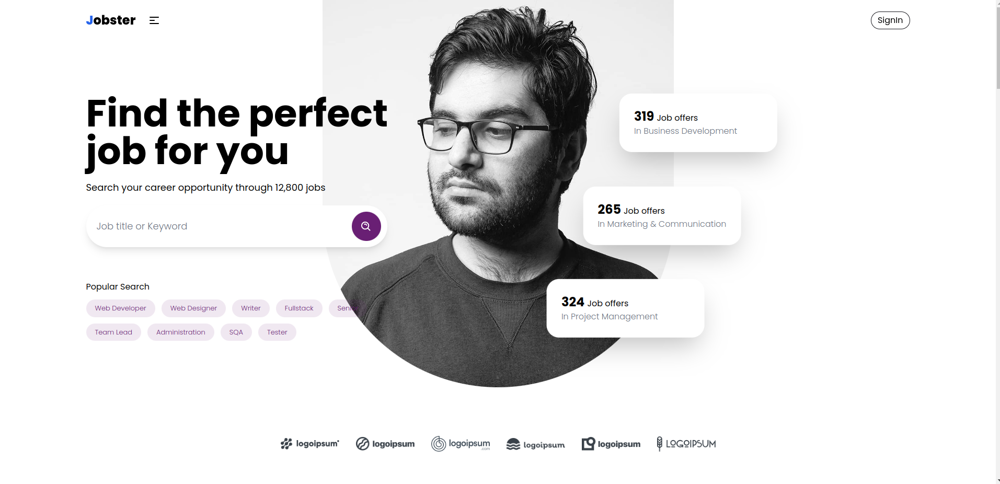

# Jobster 💼

Jobster - a platform which brings together companies and candidates in one place. Companies can easily post jobs, review applications, and manage candidate interactions, while candidates can apply jobs, track applications. User-friendly dashboards for both company and candidate users provide easy profile management, analytics, and instant notifications, making the entire recruitment experience smooth and efficient.

##### Live Site: https://jobsterr.vercel.app/

##### Server Code: https://github.com/RiyaadHossain/Jobster-Server

## Features

### Authentication and Authorization

- Email-based authorization ensures secure user registration and login.
- Cookie-based authentication enhances user security and maintains session persistence.

### User Roles

- **Company User:**

  - Register and log in as a company.
  - Post job openings with detailed job descriptions.
  - Access a dashboard displaying a list of posted jobs and the corresponding list of candidates who applied.

- **Candidate User:**
  - Register and log in as a candidate.
  - Apply for available jobs through a user-friendly interface.
  - Access a dashboard displaying a list of applications and favorite jobs.

### Dashboards

- **Company Dashboard:**

  - Create, update, and Update job status.
  - Monitor the list of posted jobs and applicants.
  - Review and manage applications received from candidates.
  - View applications, accept or reject candidates, and manage the hiring process.
  - Edit company profile and track profile views, application counts, and notifications.

- **Candidate Dashboard:**
  - View applications and favorite jobs.
  - Review the status of previous job applications.
  - Edit candidate profile and monitor profile views, application counts, and notifications.

## Technologies Used

> Frontend: React, TailwindCSS, React Router Dom, React Hook Form, Redux Toolkit, RTQ Query, Axios

> Backend: Node, Express.js

> Database: MongoDB, Mongoose

> Authentication: Jwt, Bcrypt, Cookie

> Tools: Multer, Nodemailer, EJS, Cloudinary

## Installation

To run this project locally, follow these steps:

1. Clone the repository: `git clone https://github.com/RiyaadHossain/Jobster`
2. Install dependencies: `npm install` or `yarn install`
3. Set up the database and configure the backend.
4. Run the application: `npm start` or `yarn start`

## Future Enhancements

- Implement additional features such as real-time notifications and chat functionality.
- Enhance the user interface for a more intuitive experience.
- Expand the platform to support multiple languages and regions.

## Contributing

Contributions are welcome! Feel free to open issues or submit pull requests.

## License

This project is licensed under the LicenseName - see the [LICENSE.md](LICENSE.md) file for details.
